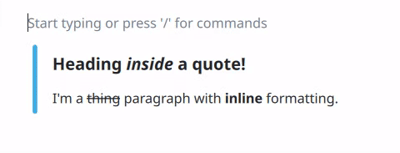
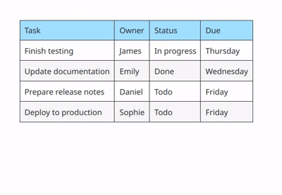
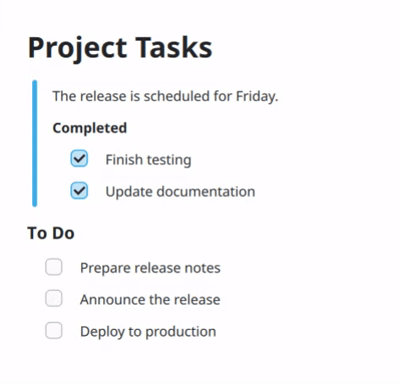

+++
date = '2026-09-17T00:00:00+05:30'
draft = false
title = "Meet Marknote's New Block Editor"
subtitle = 'A Google Summer of Code Project'
author = "Prayag Jain"
hideFromRSS = false
thumbnail = "thumb.png"
+++

# About Block Editors
A block editor is an easy to use rich text editor which treats every component of your text as a block. You may be familiar with apps like Notion and the editor you see there is exactly that. A block editor allows you to easily re-order your components and make your editing workflow feel more interactive. Most block editors that you will see online support a subset of CommonMark's features such as headings, lists, quotes, and tables which makes editing even more seamless.

## Why?
Traditional text editors feature one continuous text field for you to write down content. This is fine if you need simple formatting and do not need frequent rearrangement. However, if you need structured and extensible content, reusable components, easy rearrangement, and better pragmatic control, block editors are an excellent choice.  

Marknote has been a popular note taking app for Linux for a few years now. It supported a subset of Markdown in edit mode and Qt's built-in markdown parser that's present in the `TextArea` QML component to load markdown files. This means that markdown parsing was handled in two separate ways, when you launch Marknote, Qt's built-in markdown parser would render the content, but when you edit the document in real time, a bunch of pattern matching rules decided how to auto-transform the current text into formatted text. For example, rules like "Is the current word surrounded by asterisks (*)?". These rules worked fine for simple use cases, but they introduced unhandled edge-cases and were very hard to extend and maintain.

# Marknote's New Block Editor



This is Marknote's new block editor. It supports the full CommonMark spec, powered by KDE's new markdown parser known as [md4qt](https://invent.kde.org/libraries/md4qt/). It supports everything you might expect from a markdown editor and more. You can drag-and-drop component anywhere you want. It features an easy to use command prompt which you can invoke by pressing slash (/) on your keyboard. You can see it in action in the video above.

## Challenges
Implementing this block editor was challenging yet fun. The first challenge was to render nested components in QML. This challenge and how I solved it is described in detail [here](/posts/gsoc-june-update/#implementing-delegates). After this, I was able to easily render markdown documents using nested QML components. The next challenge was to allow editing those blocks.

### Editing Blocks
MD4Qt parses markdown in the form of abstract syntax trees (ASTs). You can traverse the tree, modify it, or delete nodes from it. What I needed was a way to edit the text content. When you edit a block in realtime, parsing its markdown content on every keystroke is not a good idea because of potential performance issues. This is why, the block editor is implemented this way: you will see the raw markdown of the paragraph block you're currently editing. Only when the current block goes out of focus (by switching to another block or pressing <kbd>Esc</kbd>), the content will be parsed. This means you can paste an entire markdown document in a block and it will easily expand into blocks as if you had pasted actual blocks! Auto transformation for blocks based on very simple rules is still present. For examples, you can create headings by pressing one or more times `#` followed by a space. These are only a handful of these rules so there aren't any edge cases.

### Implementing Tables
Tables are very complex in nature. Each table has multiple rows and columns, which means multiple text fields. I took inspiration from other block editors here. Each table is just one block. It can not have nested blocks inside it. This made it easier to implement them. In the old editor, tables were very simple. They didn't have any controls to delete or modify rows. Since each component here is designed in QML, I had a lot of flexibility in how I want the tables to look and be controlled. So each table now has buttons to insert and delete rows and columns. I'll soon also add the ability to drag and drop table columns and rows.

### Drag and Drop
The next challenge was to implement drag-and-drop. Since markdown can become complex with its nesting features, I needed a way to make sure it feels very natural. The most important thing was to place the drag handle in a place which does not make it look awkward. Since blocks can be nested, each nested block had to have its own drag handle. Most block editors either don't support nested blocks or the ones which do, do not allow dragging them when they're nested. I wanted both, so after many trials, I made the handles invisible at first. When you hover over a block, you will see its drag handle, and when you hover over the drag handle, the entire block shifts a little towards the right, clearly indicating which part of the block you're about to drag (which is essential to know here because of nesting). I immediately liked this way of doing it so I stuck with it. Implementing the remaining logic was pretty straightfoward with QML's `DropArea` and `DragHandler` elements.

### Fixing Existing Features
Marknote had a good list of features implemented by many different contributors, for example, search and replace, a table of contents drawer, source mode, GUI formatting controls, internal note links, and an emoji picker. These are strictly tied to the old text editor. Fixing them required understanding the old code and making them work with the new editor. For some features like search and replace, I had to go with workarounds due to lack of enough time. Searching within the block editor works as intended, however, when you open the replace field as well, you will be moved to the source mode which contains the raw markdown of the file. I have plans to change this behavior in the future, but it does the job for now. 

# Conclusion
This project was part of my Google Summer of Code 2026 project. I had a lot of fun implementing it and learned a lot. I'm very grateful to my mentors [Carl Schwan](https://carlschwan.eu/) and [Mathis Brüchert](https://invent.kde.org/mbruchert) for their support in the development of the block editor. My plans are to continue working on Marknote to make it the best note taking app on Linux. I'm also involved in other KDE projects such as [Drawy](https://invent.kde.org/graphics/drawy) and am planning to contribute to Plasma as well as I recently switched from Hyprland to KDE Plasma and have been loving the convenience it comes with. I believe the KDE ecosystem is the future of Linux and I want to contribute to it as much as I can. Thanks for reading this blog. As always, no AI was used to write this blog and all words are my own.
